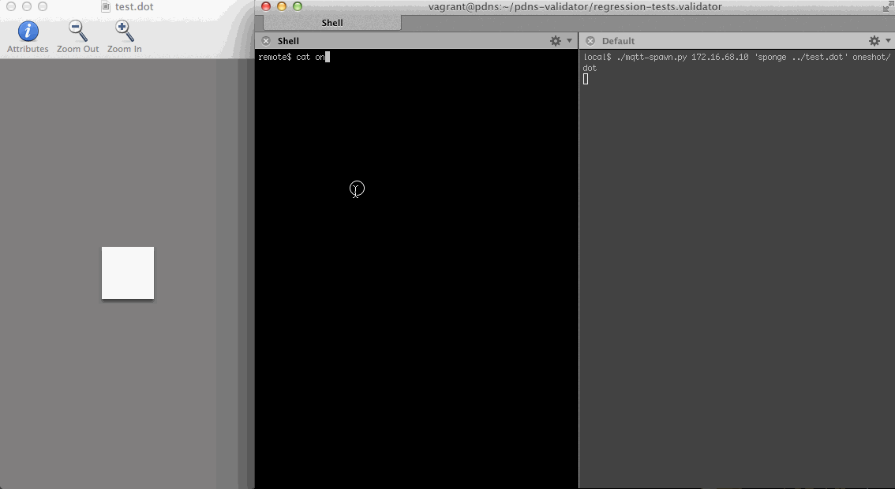

mqtt-spawn
==========

Spawn a process per MQTT message, provide message on stdin

Usage:

    ./mqtt-spawn.py <host> <cmd> <topic1> <topic2> ..

Example:

    ./mqtt-spawn.py 172.16.68.10 'dotty -' oneshot/dot

will plot every graphviz message received on `oneshot/dot`.

(My actual usage is `./mqtt-spawn.py 172.16.68.10 'sponge ../test.dot' oneshot/dot` with GraphViz.app for OS X opened on `test.dot`. `cat > ../test.dot` also works but is not as clean).

Example message from actual usage:

    mosquitto_pub -s -t oneshot/dot << EOF
    digraph oneshot {
        subgraph cluster_ { DS_ -> DNSKEY_ [ label = "19036/2" ]; label = "zone: "; }
        DNSKEY_ -> DNSKEY_;
        DNSKEY_ -> DS_org;
        DNSKEY_ -> DS_org;
        subgraph cluster_org { DS_org -> DNSKEY_org [ label = "21366/1" ]; label = "zone: org"; }
        subgraph cluster_org { DS_org -> DNSKEY_org [ label = "21366/2" ]; label = "zone: org"; }
        DNSKEY_org -> DNSKEY_org;
        DNSKEY_org -> DNSKEY_org;
        DNSKEY_org -> DS_powerdnssec_org;
        subgraph cluster_powerdnssec_org { DS_powerdnssec_org -> DNSKEY_powerdnssec_org [ label = "2224/1" ]; label = "zone: powerdnssec.org"; }
        DNSKEY_powerdnssec_org -> DNSKEY_powerdnssec_org;
    }
    EOF

Mandatory screencast:

